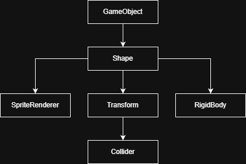

# Physics Sim
- A physics simulator/game engine to facilitate my work in my Programming Project module. It uses Processing hence Java and the naming conventions and object hierarchies are highly inspired from the Unity game engine.
## Functions:
- Rigidbodies that support linear and angular motion (although torque has not been implemented yet)
- Separating Axis Theorem (SAT) collision detection and calculations for elastic/inelastic (or in between) collision results (collisions for now apply to rectangles and circles)
- Sprite rendering
- Built-in assets (Timer & GameObject) that allow scriptable game mechanics and collision response

## How to Use:
- The PhysicsSim.pde file is the main file where the standard Processing functions (setup and draw) reside
- Use the Assets.pde file to declare custom game objects to be instantiated

### Initialise Environment:
- The way that this library is built requires the usage of P3D rendering mode. Use the following line of code in the Processing setup() method with your screen size of preference.
```java
void setup(){
  size(screenSizeX, screenSizeY, P3D);
}
```
- Append the following lines to (preferably) the end of the Processing draw() method
```java
void draw(){
  ...

  SceneManager.updateActive();
}
```

### Create a GameObject:
- Create a class that inherits from GameObject
```java
class Player extends GameObject {

}
```
- Each GameObject must call the parent class' constructor in its own constructor
```java
class Player extends GameObject {

  public Player(Shape2D obj){
      super(obj);
      //Your code here
  }
}
```
- (Optional) You can also change the tag of the GameObject or add new attributes
```java
class Player extends GameObject {

  public Player(Shape2D obj){
      super(obj);
      this.lives = lives;
      this.tag = "Player";
      //Your code here
  }
}
```
- Now you can switch to the main file (PhysicsSim.pde) and create the object by using standard Java object creation methods within the setup() method
- Each GameObject has to take at least one parameter of type Shape2D. To construct a Shape2D, use the class ShapeBuilder (one of which is already instantiated as ***shapeBuilder***) as following:
```java
void setup(){
  //Possible collider types: ColliderType.Square, ColliderType.Rectangle, ColliderType.Circle
  Player player = new Player(shapeBuilder.setPos(float posX, float posY)
                                         .setSize(float sizeX, float sizeY)
                                         .setCollider(ColliderType ct)
                                         .addImage(PImage img, float imgSizeX, float imgSizeY)
                                         .build());
}
```
- Currently the IDE's give a unused warning for each object creation line (if the object is not used elsewhere and only instantiated). This is because its constructor adds it to the scene and every object in the scene gets updated, without the need of an additional usage of the object. You can just ignore these or use the **@SuppressWarnings("unused")** line above the method you instantiated your object in.
- The ***.addImage()*** method is optional. If not provided, the engine will create a shape based on the collider type instead.

### GameObject Methods:
- update(): Runs every frame, include it in your class to change behaviour
```java
class Player extends GameObject {
  ...
  @Override
  public void update(){
    //This part runs every frame
  }
}
```
- destroy(): Removes the object from the scene, and hence destroys the object. Run:
```java
class Player extends GameObject {
  ...
  public void gameOver(int lives){
    if (lives <= 0) { this.destroy(); }
  }
}
```
- setLayer(int layer): Changes the order of rendering for the object, lower values will make the object render behind the scene compared to others. Do not change the layer directly as it will not update the list of objects to render properly.
```java
class Player extends GameObject {
  ...
  public Player(Shape2D obj){
    super(obj);
    this.setLayer(-5);
  }
}
```
- getLayer(): Returns the layer value of the object.
- onCollisionEnter(GameObject other): Triggers when the current object collides with a non-trigger collider, you can compare the tag of the other object to run on specific collisions
```java
class Player extends GameObject {
  ...
  @Override
  public void onCollisionEnter(GameObject other){
    if (other.tag.equals("Bullet")){
      this.lives--;
    }
  }
}
```
- onTriggerEnter(GameObject other): Triggers when the current object collides with a trigger collider (Does not trigger if both objects are triggers)
```java
class Player extends GameObject {
  ...
  @Override
  public void onTriggerEnter(GameObject other){
    //Code here
  }
}
```
- onCollisionExit(GameObject other): Triggers when the current object stops colliding with a non-trigger collider
```java
class Player extends GameObject {
  ...
  @Override
  public void onCollisionExit(GameObject other){
    //Code here
  }
}
```
- onTriggerExit(GameObject other): Triggers when the current object stops colliding with a trigger collider (Does not trigger if both objects are triggers)
```java
class Player extends GameObject {
  ...
  @Override
  public void onTriggerExit(GameObject other){
    //Code here
  }
}
```

### Scene Management:
- The way each set of objects are rendered is through scenes. Each scene contains its own list of shapes and game objects, and also contains components called *utilities*.
- A default scene is already present by the name *defaultScene*.
- By default, *defaultScene* includes all three utilities, which are:
  - ObjectHandler: Updates each object every frame, this is the component that allows physics and motion.
  - CollisionHandler:  Calculates the collision states and collision results of the objects in the scene.
  - ShapeDrawer: Draws all the objects present in the scene.
#### Creating a New Scene:
- Use the **Scene** class to create a new scene:
```java
Scene exampleScene = new Scene(boolean useDefault);
```
- The *useDefault* parameter adds all the utilities to the scene and appends the scene to the SceneManager if set to true.
- If aren't using a default preset, append the scene to the SceneManager using the following line of code:
```java
SceneManager.addScene(exampleScene);
```
- The ***.addScene()*** method can also take a *name* variable for custom scene names, if not provided, the name of the scene will be its index in the list of scenes within SceneManager:
```java
SceneManager.addScene(exampleScene, "SceneName");
```

#### Adding/Removing Utilities:
- To add a utility to a scene, it is necessary to instantiate the utility first, and then append it using the ***Scene.addHandler()*** method.
- There can only be one of each type of utility in one scene.
```java
ObjectHandler oh = new ObjectHandler();
exampleScene.addHandler(oh);
```
- To remove a utility from a scene, use the **UtilityType** type as following:
```java
exampleScene.removeHandler(UtilityType.Shapes); //ShapeDrawer
exampleScene.removeHandler(UtilityType.Objects); //ObjectHandler
exampleScene.removeHandler(UtilityType.Collisions); //CollisionHandler
```

#### Changing Active Scene:
- Simply use the ***SceneManager.changeScene()*** method with the scene name to switch the active scene.
```java
SceneManager.changeScene("SceneName");
```
- You can use the ***SceneManager.listScenes()*** method to print a list of scene names within your environment.

#### Update Active Scene:
- Use the following line of code in the Processing draw() method as also shown at the beginning of this document.
```java
void draw(){
  ...

  SceneManager.updateActive();
}
```
***Important:*** The instantiated objects are appended to the list of the current active scene.
### Creating Preset Shapes:
- You can use the **ShapeBuilder** class to create preset shapes:
- Initialise a new ShapeBuilder, do not use the built-in one, that one is made for general object creation. (I mean if you know what you are doing you can technically use that one, but it is not recommended.)
- Populate the properties of each shape.
- Use the ***.build()*** method to create a new shape.
```java
ShapeBuilder enemyPreset = new ShapeBuilder(); //Initialise

void setup(){
  ...

  enemyPreset.setPos(float posX, float posY)
             .setSize(float sizeX, float sizeY)
             .setCollider(ColliderType ct)
             .addImage(PImage img, float imgSizeX, float imgSizeY)
             .build()); //Set properties

  new Enemy(enemyPreset.build()); //Create the shape
}
```
## Full Reference:
- This part contains most functions that each component has (excluding structural functions for the program to work)
### Component Hierarchy:

<p align="center">
  
</p>

- Each GameObject contains the above components that all serve different purposes
##### ***Shape (Shape2D):*** Can be accessed as ***GameObject.shape***
  - ***.setColor(int R, int G, int B)***: Sets shape color to the given RGB value, does nothing if the shape has a sprite
  - ***.points()***: Returns the matrix of object's vertex coordinates. The matrix's first and second rows specify the x and y coordinates, respectively.
  - ***.imagePoints()***: Returns the matrix of object's image's vertex coordinates.
  - ***.changeColor(int spdR, int spdG, int spdB)***: Makes the shape smoothly change color by incrementing/decrementing its RGB values.
  - ***.wrapAround (type: boolean)***: If set to true, the shape will wrap around the screen (while leaving the screen from the right, will appear from the left for example). Collisions and images currently does not work with wrapping.
##### ***Transform:*** Can be accessed as ***GameObject.shape.transform***
  - ***.pos (type: Vector2D)***: Specifies the position of the Transform. Individual components can be accessed by ***...pos.x*** or ***...pos.y***.
  - ***.translatePos()***: Translates all vertices to the new Transform position.
  - ***.rotateVertices(float rotInRad)***: Rotates all vertices counter-clockwise around the object's center by an angle of ***rotInRad*** which is in radians.
  - ***.setRotation(float radians)***: Sets the rotation of the object to the positive angle specified in radians.
##### ***Rigidbody (Rigidbody2D):*** Can be accessed as ***GameObject.shape.rb***
  - ***.velocity (type: Vector2D)***: The velocity of the object. Individual components can be accessed by ***...velocity.x*** or ***...velocity.y***.
  - ***.angularVelocity (type: float)***: The angular velocity of the object. Positive angular velocity will have a counter-clockwise rotation effect.
  - ***.force (type: Vector2D)***: The continuous force that is being applied to the object. By default it is the zero vector.
##### ***Sprite Renderer:*** Can be accessed as ***GameObject.shape.sr***
  - ***.img (type: PImage)***: The sprite that is rendered on the object.
  - ***.size (type: Vector2D)***: The size of the rendered image on the object.
##### ***Collider (Collider2D):*** Can be accessed as ***GameObject.shape.transform.collider***
  - ***.enabled (type: boolean)***: Does nothing, for now. :)
  - ***.isStatic (type: boolean)***: Determines if the object is static. If it is static, then velocities and forces do not apply to the object, but the object still has collision.
  - ***.isTrigger (type: boolean)***: Determines if the object is a trigger. If it is a trigger, there will be no dynamic collision response (Object will pass right through), however, the collision will still be detected.
  - ***.type (type: ColliderType)***: The collider type of the object, current supported types are ColliderType.Square, ColliderType.Rectangle, and ColliderType.Circle. This affects what will be drawn on the screen given the image has no sprite.
  - ***.setCor(float value)***: Sets the coefficient of restitution for the collider. Must be between 0 and 1 inclusive (0: Perfectly inelastic, 1: Perfectly elastic). If two objects with different COR's collide, the minimum is taken.
  - ***.getCor()***: Returns the coefficient of restitution of the collider.
---
### Tools:
- These are the helping libraries to support abstract structures such as matrices and vectors.
#### Linear Algebra:
- A Mathf type is already initialised:
```java
Mathf mathf = new Mathf();
```
##### *Mathf:* Can be accessed as *mathf*
- ***.clamp(float variable, float min, float max)***: Limits the *variable* so that it never goes beyond *min* and *max*.
- ***.deg2Rad(float degrees)***: Turns a value in degrees to radians.
- ***.checkSign(float x)***: Returns the sign of the value. +/0/- -> 1/0/-1
- ***.randInt(int range)***: Returns a random integer between 0 (inclusive) and *range* (exclusive).
##### *Vector2D(float x, float y):*
- ***.x/y***: Access the x/y component.
- ***.vectorSum(Vector2D vec)***: Adds *vec* to the current vector and returns it.
- ***.vectorSum(Vector2D vec1, Vector2D vec2)***: Adds *vec1* and *vec2* and returns it as a new vector. Does not change the original vector.
- ***.scalarMul(float value)***: Multiplies each component of the original vector by *value*. Changes and returns the original vector.
- ***.scalarMul(Vector2D vec, float value)***: Multiplies *vec*'s components with *value*, and returns the result as a new vector. Does not change the original vector.
- ***.negate()***: Negates the original vector and returns it.
- ***.negate(Vector2D vec)***: Negates *vec* and returns the resultant vector as a new vector. Does not change the original vector.
- ***.dotProduct(Vector2D vec)***: Calculates the dot product of the original vector and *vec* and returns it as a float.
- ***.magnitude()***: Calculates the magnitude of the vector and returns it as a float.
- ***.normalise()***: Normalises the original vector and returns it.
- ***.scalarProject(Vector2D vec, boolean normalise)***: Scalar projects the original vector onto *vec* and returns the resultant value as a float. If *normalise* is set to true, divides the result with the magnitude of *vec2*.
##### *Matrix(int rows, int columns):*
- ***.getVal(int rowIndex, int columnIndex)***: Returns the value at the *rowIndex*th row and *columnIndex*th column.
- ***.setVal(int rowIndex, int columnIndex, float value)***: Sets the value at the *rowIndex*th row and *columnIndex*th column to *value*.
- ***.getVec(int columnIndex)***: Returns the column vector at the *columnIndex*th column.
- ***.setVec(Vector2D vec, int columnIndex)***: Sets the column vector at the *columnIndex*th column to *vec*.
- ***.setArray(float[][] matrix)***: Sets the array of the matrix to a clone of the given array.
- ***.matMul(Matrix matrix)***: Multiplies the original matrix with the given matrix and returns the result as a new Matrix.

#### Built-Ins:
##### *Timer(int timer):*
- Returns true after the given amount of frame count, must be updated each frame. Example use:
```java
Timer gameTimer = new Timer(50);
...
void setup(){
  gameTimer.startTimer();
}
...
void draw(){
  boolean timerTriggered = gameTimer.updateTime();
  if (timerTriggered){
    //Functionality here
    gameTimer.startTimer();
  }
}
...
```

**Note: This documentation is still work in progress.**
